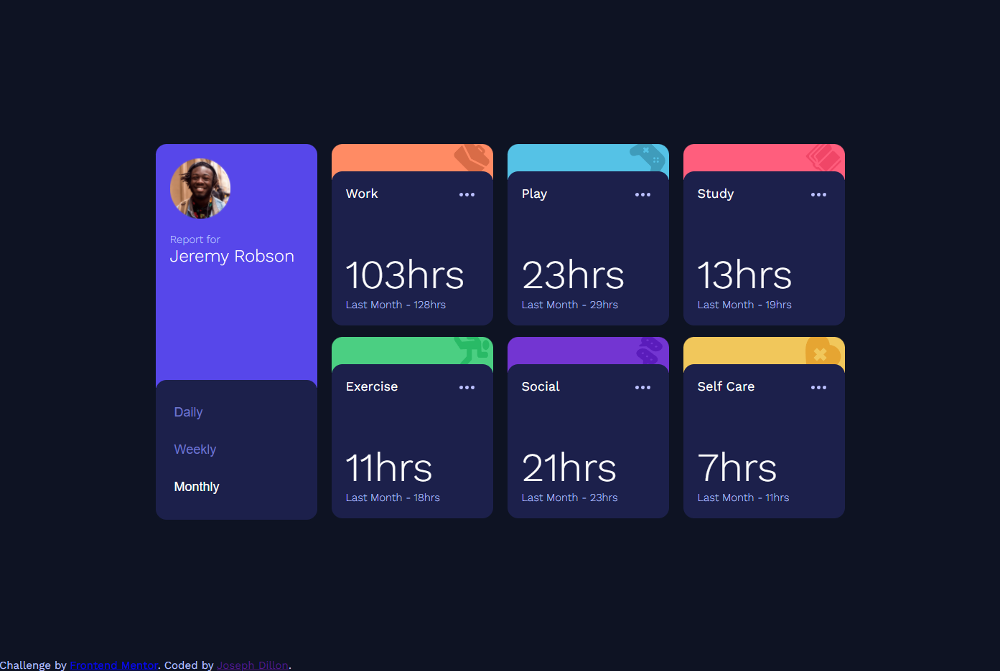
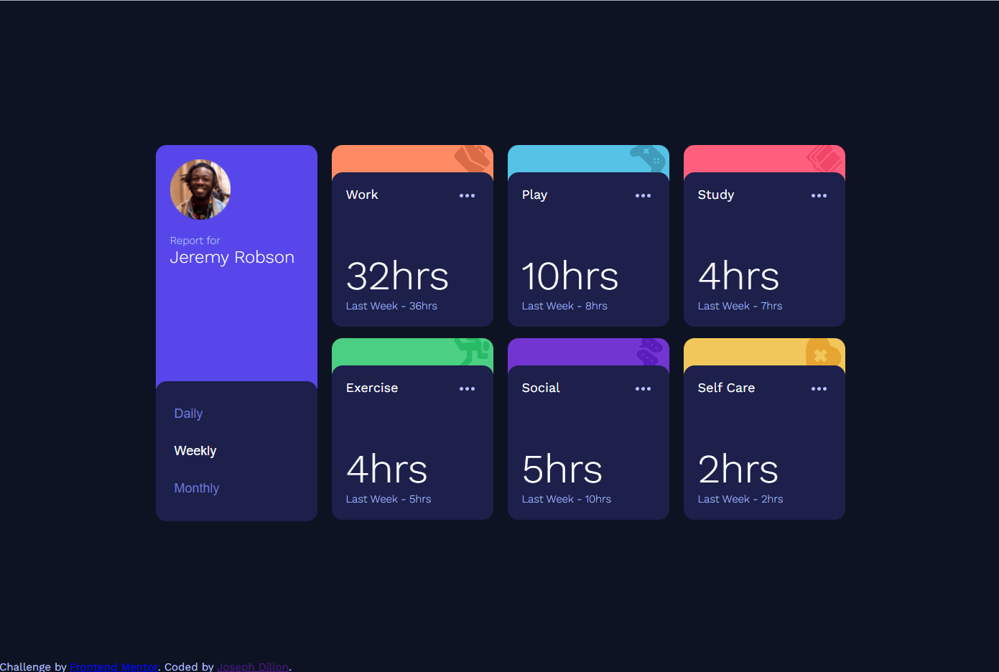
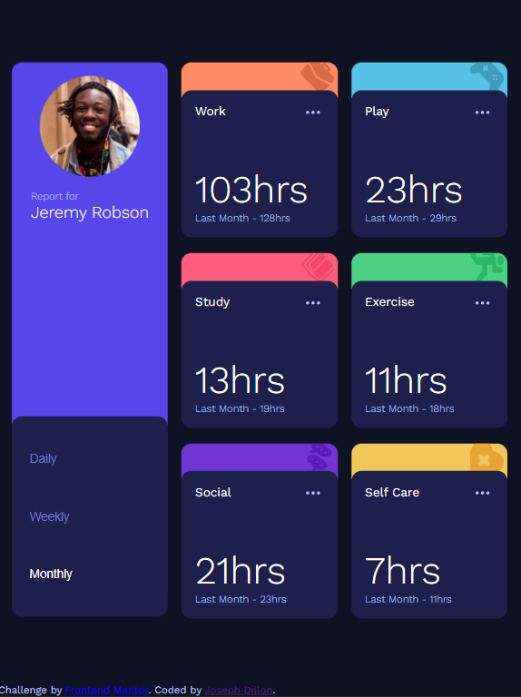
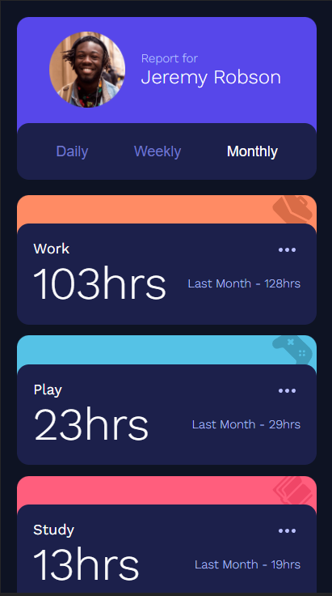

# Frontend Mentor - Time tracking dashboard solution

This is a solution to the [Time tracking dashboard challenge on Frontend Mentor](https://www.frontendmentor.io/challenges/time-tracking-dashboard-UIQ7167Jw). Frontend Mentor challenges help you improve your coding skills by building realistic projects.

## Table of contents

- [Overview](#overview)
  - [The challenge](#the-challenge)
  - [Screenshot](#screenshot)
  - [Links](#links)
- [My process](#my-process)
  - [Built with](#built-with)
  - [What I learned](#what-i-learned)

**Note: Delete this note and update the table of contents based on what sections you keep.**

## Overview

I opted to do this with native CSS and vanilla JavaScript for the fun of it. However the design of it really lends itself to react since its a very repeated pattern with only config changes.
### The challenge

Users should be able to:

- View the optimal layout for the site depending on their device's screen size
- See hover states for all interactive elements on the page
- Switch between viewing Daily, Weekly, and Monthly stats

Extra Credit:
- Implement a tablet layout

### Screenshots

Desktop: On the "Monthly" setting

Desktop: On the "Weekly" setting

Tablet: On the "Monthly" setting

Mobile: On the "Monthly" setting

### Links

- Solution URL: [Github](https://github.com/JDillon522/FrontendMaster-time-tracking-dashboard)
- Live Site URL: [Github Pages](https://jdillon522.github.io/FrontendMaster-time-tracking-dashboard/)

### Built with

- Semantic HTML5 markup
- CSS custom properties
- Flexbox
- CSS Grid
- Mobile-first workflow

### What I learned

This was actually my first time using grid. While it offers a lot of neat features I think I prefer using Flexbox to organize things.
